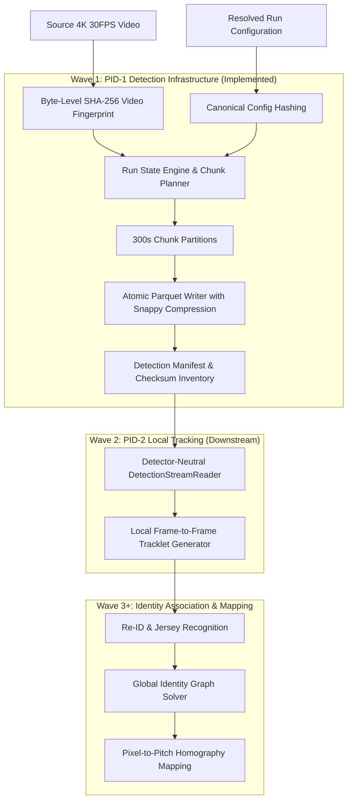

# Football Identity Reconstruction — Machine Vision System

A high-performance, deterministic computer vision and data infrastructure system designed for full-match player tracking, identity reconstruction, and spatio-temporal analytics from single-camera 4K football footage.

---

## Table of Contents

- [Overview](#overview)
- [Target Environment & Hardware](#target-environment--hardware)
- [System Architecture & Multi-Wave Roadmap](#system-architecture--multi-wave-roadmap)
- [Current Implementation (Wave 1 Data Plane)](#current-implementation-wave-1-data-plane)
  - [1. Data Contracts & Invariant Enforcement](#1-data-contracts--invariant-enforcement)
  - [2. Storage & Atomic Publication](#2-storage--atomic-publication)
  - [3. Chunk Planning & Fault-Tolerant State Engine](#3-chunk-planning--fault-tolerant-state-engine)
  - [4. Detector-Neutral PID-2 Streaming Reader](#4-detector-neutral-pid-2-streaming-reader)
- [Project Layout](#project-layout)
- [Getting Started & Installation](#getting-started--installation)
- [Testing & Quality Verification](#testing--quality-verification)
- [Evidence, Audit & Test Reports](#evidence-audit--test-reports)
- [Python API Usage Examples](#python-api-usage-examples)
- [License](#license)

---

## Overview

The Football Identity Reconstruction project reconstructs persistent player identities across an entire 90-minute 4K match video. Because running high-accuracy detection on ~180,000 4K frames is computationally demanding, the architecture decouples detection generation from downstream tracking, Re-ID, and graph optimization.

Wave 1 delivers the **Detection Infrastructure and Integration Foundation**: a compact, validated, resumable, and detector-neutral data plane that serializes, validates, and serves PID-1 player detections to downstream stages (PID-2 Local Tracking).

---

## Target Environment & Hardware

| Parameter | Specification |
|---|---|
| **Target Video** | One full-match 4K broadcast video ($3840 \times 2160$, 30 FPS, ~180,000 frames, ~90–100 min) |
| **Target GPU** | NVIDIA GeForce RTX 4050 Laptop GPU (6 GB VRAM) |
| **Target CPU / RAM** | Intel Core i7-13700 / 16 GB System RAM |
| **Python Version** | Python 3.10+ (tested on Python 3.14.3) |
| **Primary Dependencies** | PyArrow ($\ge 14.0.0$), PyYAML ($\ge 6.0$), Pydantic ($\ge 2.0$), Pytest ($\ge 8.0$) |

---

## System Architecture & Multi-Wave Roadmap



- **Wave 1 (Current):** Detection Infrastructure, Parquet storage plane, chunk state machine, corruption recovery, and detector-neutral reader.
- **Wave 2 (Upcoming):** Local Tracking (PID-2) consuming streamed detection batches across chunk boundaries.
- **Wave 3+ (Upcoming):** Team classification, jersey number recognition, Re-ID embedding, global multi-camera/graph solver, and pitch homography.

---

## Current Implementation (Wave 1 Data Plane)

### 1. Data Contracts & Invariant Enforcement
- **Detection Schema v1:** Built on PyArrow schema definitions ensuring fixed data types (`int16`, `int32`, `int64`, `float32`, `string`).
- **Geometric Invariants:** Strict rejection of non-finite values (`NaN`, `±Inf`), inverted coordinates ($x_1 \ge x_2$, $y_1 \ge y_2$), or coordinates outside source dimensions.
- **Derived Bottom Center:** Mandatory derived point $\left(\frac{x_1+x_2}{2}, y_2\right)$ within a $10^{-3}$ float tolerance.
- **Uniqueness:** Unique composite key across `(run_id, source, frame_id, tile_id, detection_index)`.
- **Canonical Configuration Hashing:** Deterministic 64-character SHA-256 hash invariant to YAML formatting, comments, and key order, but strictly sensitive to any parameter change.
- **Source Video Fingerprint:** Byte-level SHA-256 digest ensuring identity is bound to content rather than file paths.

### 2. Storage & Atomic Publication
- **Storage Format:** Apache Parquet with dictionary encoding and Snappy compression. Zero Python pickle files or monolithic JSON dumps.
- **Two-Phase Atomic Commit:** Writes to `.tmp.<uuid>`, flushes and fsyncs, performs disk read-back validation, computes SHA-256, and atomically renames via `os.replace`.
- **Integrity Verification:** The detection manifest records partition file sizes, row counts, and SHA-256 digests. Tampered files are detected instantly.

### 3. Chunk Planning & Fault-Tolerant State Engine
- **Deterministic Planning:** Splits match video into contiguous, non-overlapping frame ranges (e.g. 300 seconds = 9,000 frames at 30 FPS).
- **Safe Resume & Chunk Reuse:** Reuses completed chunks matching configuration and video digests without re-computation; retries interrupted or failed chunks.
- **Corruption Detection:** Recomputes file SHA-256 on resume; auto-schedules corrupted partitions for re-execution.
- **Incompatible Invalidation:** Automatically invalidates runs when video fingerprint or canonical configuration hash changes.

### 4. Detector-Neutral PID-2 Streaming Reader
- **Memory-Bounded Streaming:** Iterates through batches chunk-by-chunk using PyArrow record batches without loading the entire 4K match into 16 GB memory.
- **Boundary Traversal:** Transparently streams across chunk boundaries in monotonic `frame_id` and `detection_index` order.
- **Zero Detector Dependencies:** Does not import PyTorch, Ultralytics, TensorRT, OpenCV, or CUDA.

---

## Project Layout

```text
MachineVision/
├── pyproject.toml                     # Package definition and pytest configuration
├── README.md                          # Project root documentation (this file)
├── dependency_changes.txt             # Dependency change log
├── docs/
│   └── 01_wave1_detection_infrastructure_work_order.md
├── src/
│   └── football_identity/
│       ├── contracts/                 # Schema definitions, config hashing, video fingerprinting
│       │   ├── detection.py
│       │   ├── config.py
│       │   └── video.py
│       ├── artifacts/                 # Parquet IO, manifest integrity, directory layout
│       │   ├── layout.py
│       │   ├── manifest.py
│       │   ├── parquet_writer.py
│       │   └── parquet_reader.py
│       ├── runtime/                   # Chunk planning, state machine, logging, resume/retry
│       │   ├── chunk_planner.py
│       │   ├── chunk_state.py
│       │   ├── logger.py
│       │   └── state_engine.py
│       └── integration/               # Detector-neutral streaming reader for PID-2
│           └── detection_reader.py
├── tests/
│   ├── README.md                      # Quick-start testing instructions
│   ├── contracts/                     # Schema, float validity, hash stability tests
│   ├── runtime/                       # Chunk planning, resume, retry, invalidation tests
│   ├── artifacts/                     # Atomic publication, layout, Parquet IO tests
│   └── integration/                   # PID-2 reader boundary traversal & isolation tests
└── evidence/
    └── worker_a/                      # Complete formal delivery & audit package
        ├── README.md                  # Comprehensive Master Report & Testing Guide
        ├── handoff.md                 # Formal Handoff Summary
        ├── requirements_matrix.md     # Requirements Traceability Matrix
        ├── preflight.md               # Environment Preflight Audit
        ├── changed_files.txt          # Inventory of Changed Files
        ├── test_commands.txt          # Test Commands Reference
        ├── test_output.txt            # Verbose 35-Test Execution Log
        ├── corruption_test_result.txt # Checksum Corruption Test Output
        ├── resume_test_result.txt     # Resume/Retry Test Output
        └── sample_manifest.json       # Reference Detection Manifest
```

---

## Getting Started & Installation

### 1. Clone & Set Up Environment
```bash
git clone https://github.com/IMROVOID/MachineVision.git
cd MachineVision
python -m venv .venv
source .venv/bin/activate  # On Windows: .venv\Scripts\activate
```

### 2. Install Package in Editable Mode
```bash
pip install -e .
```
Or install core dependencies directly:
```bash
pip install pyarrow>=14.0.0 pyyaml>=6.0 pydantic>=2.0 pytest>=8.0
```

---

## Testing & Quality Verification

All 46 tests pass with zero skips and zero failures.

### Run All Mandatory Tests
```bash
python -m pytest tests/contracts tests/runtime tests/artifacts tests/integration/test_detection_reader.py -v
```

### Run Specific Test Suites
```bash
# Run Contracts & Schema Invariants suite (13 tests)
python -m pytest tests/contracts -v

# Run State Engine, Resume & Invalidation suite (17 tests)
python -m pytest tests/runtime -v

# Run Parquet IO, Atomic Publication, Layout & Fixtures suite (10 tests)
python -m pytest tests/artifacts -v

# Run PID-2 Detector-Neutral Integration suite (4 tests)
python -m pytest tests/integration -v
```

---

## Evidence, Audit & Test Reports

Detailed audit reports, test execution traces, and formal verification evidence are located under [`evidence/worker_a/`](./evidence/worker_a/):

- 📖 **[Wave 1 Master Report & Testing Guide](./evidence/worker_a/README.md)** — Comprehensive technical breakdown, catalog of all 46 tests, and manual testing guide.
- 📊 **[Requirements Traceability Matrix](./evidence/worker_a/requirements_matrix.md)** — Item-by-item verification against the Work Order.
- 📑 **[Formal Handoff Summary](./evidence/worker_a/handoff.md)** — Final delivery declaration.
- 📜 **[Full Test Execution Log](./evidence/worker_a/test_output.txt)** — Uncut test output.
- 🛡️ **[Corruption Recovery Evidence](./evidence/worker_a/corruption_test_result.txt)** — On-disk corruption detection evidence.
- 🔄 **[Resume & Retry Evidence](./evidence/worker_a/resume_test_result.txt)** — Chunk reuse and crash recovery evidence.
- 🔍 **[PID-2 Smoke Integration Result](./evidence/worker_a/detection_reader_smoke_result.txt)** — Multi-chunk boundary traversal output.

---

## Python API Usage Examples

### 1. Streaming Detections for Downstream PID-2 Consumers
```python
from football_identity.integration.detection_reader import DetectionStreamReader

# Initialize detector-neutral streaming reader
reader = DetectionStreamReader(runs_root="runs", run_id="match_2026_001")

# Stream detections sequentially across chunk boundaries with predicate filters
for det in reader.stream_detections(
    sources=["BASE_15FPS", "AUDIT_TILE_1FPS"],
    start_frame=0,
    end_frame=1500,
    min_confidence=0.4,
):
    print(
        f"Frame {det.frame_id:05d} | Det #{det.detection_index} | "
        f"Box: ({det.x1:.1f}, {det.y1:.1f}, {det.x2:.1f}, {det.y2:.1f}) | "
        f"BottomCenter: ({det.bottom_center_x:.1f}, {det.bottom_center_y:.1f}) | "
        f"Source: {det.source} | Conf: {det.confidence:.2f}"
    )
```

### 2. Atomic Parquet Partition Writing
```python
import pyarrow as pa
from football_identity.contracts.detection import (
    DETECTION_PYARROW_SCHEMA,
    DETECTION_SCHEMA_VERSION,
    compute_bottom_center,
)
from football_identity.artifacts.parquet_writer import write_detection_partition_atomic

# Prepare validated rows
x1, y1, x2, y2 = 120.0, 300.0, 240.0, 650.0
bc_x, bc_y = compute_bottom_center(x1, y1, x2, y2)

rows = [{
    "schema_version": DETECTION_SCHEMA_VERSION,
    "run_id": "match_2026_001",
    "chunk_id": 0,
    "frame_id": 0,
    "timestamp_ms": 0,
    "detection_index": 0,
    "x1": x1,
    "y1": y1,
    "x2": x2,
    "y2": y2,
    "bottom_center_x": bc_x,
    "bottom_center_y": bc_y,
    "confidence": 0.96,
    "class_label": "player",
    "source": "BASE_15FPS",
    "tile_id": None,
    "config_id": "4a5c8989bb53e164478546b5e022fbe65287f3c4c9fa3e028bfaee52fb9cb8bc",
}]

table = pa.Table.from_pylist(rows, schema=DETECTION_PYARROW_SCHEMA)

# Atomically write with on-disk read-back verification
row_count, file_size, checksum = write_detection_partition_atomic(
    table=table,
    target_path="runs/match_2026_001/pid01_detection/base/chunk-00000.parquet",
    source_width=3840.0,
    source_height=2160.0,
    compression="SNAPPY",
)
```

---

## License

Internal proprietary research & engineering codebase for Football Identity Reconstruction.
