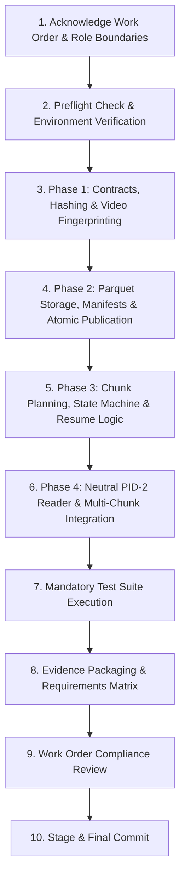

# PRD: Wave 1 Detection Infrastructure & Integration Foundation

## 1. Executive Summary & Problem Statement

In the Football Identity Project, full-match 4K 30 FPS video processing is computationally expensive. Player detections generated by PID-1 (Detection Stage) must be persisted deterministically, validated strictly, and exposed via an efficient, detector-neutral interface to PID-2 (Downstream Tracking/Identity).

**Worker A** is responsible exclusively for the **Infrastructure and Integration Data Plane**:
- Schemas and typed validation (Detection rows, Video fingerprinting, Canonical config hashing).
- Chunked Parquet storage with atomic publication, checksum manifests, and partition inventories.
- Time-based chunk planning, run state machines, resume/retry mechanics, corruption detection, and cache invalidation.
- Detector-neutral streaming reader interface for PID-2 with chunk-boundary traversal.
- Complete verification test suite and formal evidence packaging.

---

## 2. Strict Scope & Boundaries

### 2.1 Owned Logical Paths
- `src/football_identity/contracts/`
- `src/football_identity/runtime/`
- `src/football_identity/artifacts/`
- `src/football_identity/integration/detection_reader.py`
- `tests/contracts/`
- `tests/runtime/`
- `tests/artifacts/`
- `tests/integration/test_detection_reader.py`
- `tests/fixtures/detections/` (test-local fake data only)

### 2.2 Explicit Non-Goals (Strict Role Isolation)
Worker A MUST NOT implement:
- Video decoding or frame extracting (`src/football_identity/video/`).
- CUDA preprocessing or GPU memory kernels.
- Model adapters (YOLO, RF-DETR, TensorRT) or candidate benchmark runners (`src/football_identity/detection/`).
- Tracking, tracklets, Re-ID, team assignment, jersey recognition, or identity graphs (`src/football_identity/tracking/`, `src/football_identity/identity/`).
- Visual overlays, UI/dashboards, databases, or distributed execution frameworks (Ray/Spark/Celery/Airflow).

---

## 3. End-to-End Execution Roadmap (10 Steps)



1. **Acknowledge Work Order:** Confirm constraints, "Ponytail" rules, zero hard-coding, and role separation.
2. **Preflight Check:** Inspect repository, Python 3.14 environment, dependencies (`pyarrow`, `pyyaml`, `pydantic`, `pytest`), and path conflicts without making modifications.
3. **Phase 1 (Contracts):** Implement and test the Detection schema, validation rules, Canonical config hashing, and Video fingerprinting.
4. **Phase 2 (Storage):** Implement and test the Parquet partition writer, streaming reader, artifact directory layout, manifests, checksums, and atomic file publication logic.
5. **Phase 3 (State):** Implement and test time-based Chunk planning and state machines (Resume, retry, corruption detection, and invalidation rules).
6. **Phase 4 (Integration):** Implement and test the detector-neutral PID-2 reader and build a Two-chunk boundary smoke test fixture.
7. **Validation:** Run the complete mandatory test suite:
   ```bash
   python -m pytest tests/contracts tests/runtime tests/artifacts tests/integration/test_detection_reader.py -q
   ```
8. **Evidence:** Produce the required evidence package (`evidence/worker_a/`) and the requirement-to-evidence matrix.
9. **Review:** Cross-reference final delivery against the strict Work Order boundaries.
10. **Finalize:** Fix any test failures, stage, and commit work from project root after approval.

---

## 4. Detailed Technical Specifications & Contracts

### 4.1 Detection Schema Contract (`football_identity.contracts.detection`)
- **Schema Version:** `1` (`int16`).
- **Sources:** `BASE_15FPS`, `AUDIT_TILE_1FPS`, `REPAIR_30FPS`.
- **Columns:**
  - `schema_version` (int16)
  - `run_id` (string)
  - `chunk_id` (int32)
  - `frame_id` (int64, $\ge 0$)
  - `timestamp_ms` (int64, $\ge 0$, monotonically non-decreasing per frame)
  - `detection_index` (int32, $\ge 0$, unique within `(frame_id, source, tile_id)`)
  - `x1`, `y1`, `x2`, `y2` (float32, finite, original source-frame coordinates, $0 \le x_1 < x_2 \le W$, $0 \le y_1 < y_2 \le H$)
  - `bottom_center_x` (float32, equals $(x_1 + x_2) / 2 \pm 10^{-3}$)
  - `bottom_center_y` (float32, equals $y_2 \pm 10^{-3}$)
  - `confidence` (float32, finite, $\in [0.0, 1.0]$)
  - `class_label` (string)
  - `source` (string)
  - `tile_id` (string / null)
  - `config_id` (string)
- **Uniqueness Key:** `(run_id, source, frame_id, tile_id, detection_index)`
- **Explicit Clipping:** Standardized box clipping to source resolution $[0, W] \times [0, H]$.

### 4.2 Canonical Configuration Hashing (`football_identity.contracts.config`)
- Generates deterministic `config_id` via SHA-256 over normalized, sorted dictionary of all identity-bearing parameters:
  - `model_identifier`, `model_weight_digest`, `backend`, `input_resolution` (`[W, H]`), `fps_policies` (`base_fps`, `audit_fps`, `repair_fps`), `batch_size`, `confidence_thresholds`, `preprocessing_policy`, `tile_policy`, `schema_version`, `implementation_version`.
- YAML whitespace, ordering, and comment invariant.

### 4.3 Video Fingerprint Contract (`football_identity.contracts.video`)
- `video_fingerprint.json` schema:
  - `schema_name`: `"football_identity.video_fingerprint"`
  - `schema_version`: `1`
  - `source_path_recorded`: string
  - `file_size_bytes`: int64
  - `sha256`: 64 lowercase hex characters computed directly from byte content
  - `width`, `height`, `nominal_fps_num`, `nominal_fps_den`, `duration_ms`, `frame_count_reported`, `container`, `video_codec`
- Mismatch rule: Different SHA-256 means different video regardless of file name.

### 4.4 Artifact Layout & Manifests (`football_identity.artifacts`)
```text
runs/<run_id>/
  run_manifest.json
  config.resolved.yaml
  video_fingerprint.json
  logs/
    infrastructure.jsonl
  pid01_detection/
    detection_manifest.json
    chunks.json
    base/
      chunk-00000.parquet
      chunk-00001.parquet
    audit/
      chunk-00000.parquet
    repair/
      repair-<interval_id>.parquet
    previews/
    metrics/
```
- **Atomic Publication:** Write to temporary path (`*.tmp.<uuid>`) $\to$ sync $\to$ validate content/checksum $\to$ atomic rename to destination.
- **Checksums:** SHA-256 computed on published Parquet files and recorded in `detection_manifest.json` and `chunks.json`.

### 4.5 Chunk Planning & State Machine (`football_identity.runtime`)
- **Chunk Duration:** Resolved from config (e.g. 300 seconds).
- **Chunk States:** `NOT_STARTED`, `RUNNING`, `COMPLETED`, `FAILED`, `INVALIDATED`.
- **State Properties:** `chunk_id`, `start_frame`, `end_frame` (exclusive), `start_time_ms`, `end_time_ms`, `source`, `config_id`, `attempt_count`, `state`, `output_path`, `row_count`, `checksum_sha256`, `started_at`, `completed_at`, `failed_at`, `error_message`.
- **Resume Policy:** Reuses verified `COMPLETED` chunks matching `(video_sha256, config_id, schema_version)`. Retries `FAILED` / incomplete chunks. Invalidates on configuration/video mismatch.

### 4.6 PID-2 Streaming Reader Interface (`football_identity.integration.detection_reader`)
- Zero dependencies on detector or video libraries (no torch, YOLO, CUDA, cv2).
- Filters by `run_id`, `source` (or sources), `frame_range` (`[start_frame, end_frame]`), and `min_confidence` / `confidence_range`.
- Streams record batches iteratively without loading whole-match data into memory (safe for 16 GB RAM).
- Returns rows ordered deterministically by `frame_id`, then `detection_index`.

---

## 5. Non-Functional Requirements & Invariants
- **Memory Safety:** Streaming reads must not exceed 200 MB memory overhead regardless of video length.
- **Deterministic Hashes:** Hash generation must be reproducible across operating systems and Python invocations.
- **Fail-Safe Atomicity:** Crashes or power cuts mid-write must never leave corrupted artifacts marked as `COMPLETED`.
- **Zero Hard-Coding:** All hyperparameters, paths, and settings must be passed via configuration objects or YAML files.

---

## 6. Verification and Evidence Deliverables
- Complete unit, integration, negative, corruption, and resume test suite.
- Verification command:
  ```bash
  python -m pytest tests/contracts tests/runtime tests/artifacts tests/integration/test_detection_reader.py -q
  ```
- Evidence directory structure under `evidence/worker_a/` containing all 14 required files.
